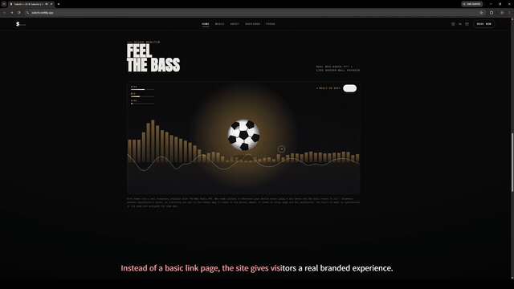
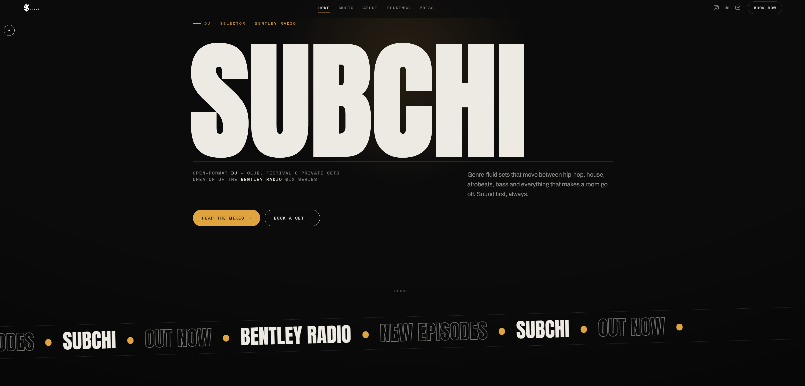
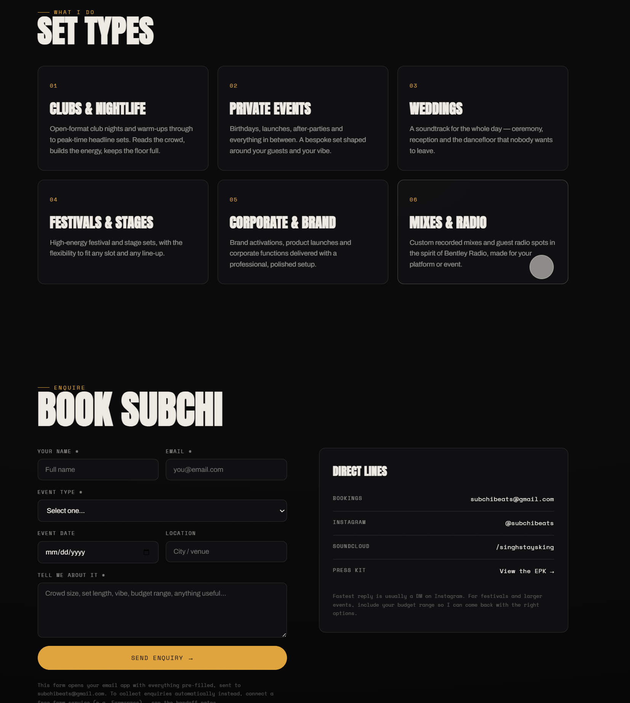
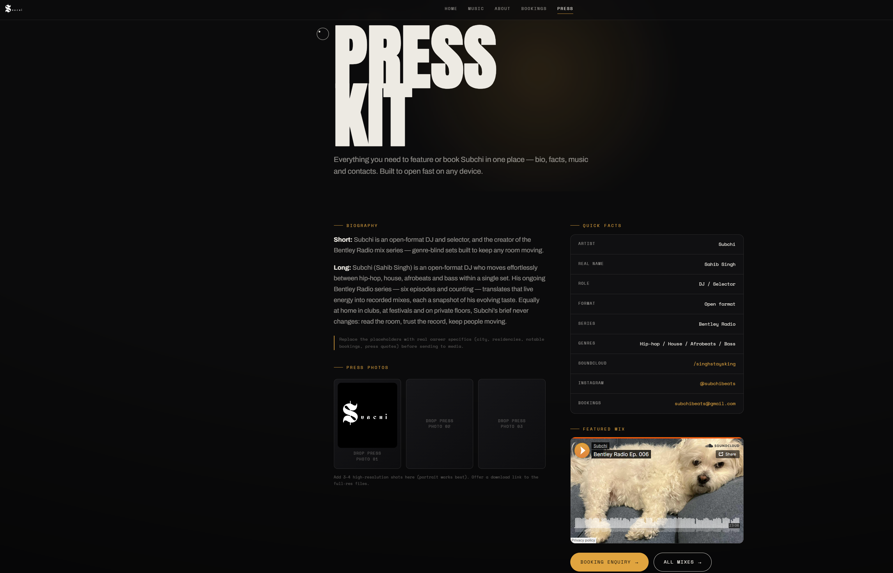

# SUBCHI — DJ & Selector Website

[](https://subchibeats.github.io/subchi-website/)
[](#tech-stack)
[](#tech-stack)
[](LICENSE)

> **▶ Live site: https://subchibeats.github.io/subchi-website/**
> &nbsp;·&nbsp; also at https://subchi.netlify.app/

A five-page artist website for **Subchi**, an open-format DJ and creator of the
*Bentley Radio* mix series. The site pairs a monochrome "brutalist-luxe" visual
language with a single amber accent, cinematic motion, and a genuinely
audio-reactive hero visualiser powered by the Web Audio API.

Every page is a single self-contained `.html` file — all CSS and JavaScript are
inlined — so the site runs identically whether you double-click a file, host it
on a static CDN, or open it on a phone. No build step, no framework, no
dependencies to install.

---

## Demo / Screenshots

**▶ Live site:** https://subchibeats.github.io/subchi-website/



🎬 **[Watch the full 1-minute promo video](../../releases/latest)** (attached to
the latest release) — or see the audio-reactive sound reactor above.

| Home | Bookings | Press / EPK |
|------|----------|-------------|
|  |  |  |

---

## Tech stack

| Area | Details |
|------|---------|
| Markup / styling | Hand-written **HTML5** + **CSS3** (custom properties, `clamp()` fluid type, CSS grid/flex, `backdrop-filter`, blend modes) |
| Scripting | **Vanilla JavaScript** (ES6+), no frameworks or libraries |
| Audio | **Web Audio API** — real-time FFT via `AnalyserNode`, live microphone capture (`getUserMedia`), and an in-page synthesised beat |
| Animation | `requestAnimationFrame` render loop, CSS keyframes, `IntersectionObserver` scroll reveals |
| Typography | **Google Fonts** — Anton (display), Archivo (body), Space Mono (mono) |
| Media | **SoundCloud** embedded players (profile player + per-episode iframes) |
| Assets | Logo, emblem and favicon are embedded as inline base64 PNGs — no external image requests |
| Tooling | **None.** Zero build step, zero `node_modules`, fully static |

---

## Features

- **Five pages** — Home, Music, About, Bookings, and Press/EPK — each fully
  self-contained.
- **Audio-reactive sound reactor** (home) — a soccer-ball visualiser driven by
  real FFT analysis. Bass drives bounce and impact; mids/highs drive spin and
  vibration; the ball rests on a live waveform with a reactive EQ spectrum and
  BASS/MID/HIGH meters. Two modes:
  - **Use mic** — runs a live FFT on whatever the device microphone hears
    (requires HTTPS + mic permission).
  - **Play built-in beat** — a short groove synthesised in-page and analysed by
    the same engine; works everywhere with no permissions.
- **Counting preloader** with reveal transition.
- **Custom cursor** (pointer-fine devices only) with hover states.
- **Fully responsive** with a full-screen animated mobile menu.
- **Scroll-triggered animations**, film-grain + vignette overlays, and tilted
  marquees.
- **SoundCloud integration** — all uploads in a profile player plus individual
  *Bentley Radio* episode cards.
- **Booking form** — client-side validation that opens the visitor's mail app
  pre-filled to the booking address (no backend required), with a documented
  upgrade path to a Formspree POST endpoint.
- **Press / EPK page** with bio, stats and contact details.
- **SEO/social ready** — Open Graph tags, theme-color, and descriptive meta.

---

## Run locally

No build tools are required.

```bash
# Option A — just open it
#   double-click index.html

# Option B — serve it (recommended; mic mode needs a real origin)
python -m http.server 8000
#   then visit http://localhost:8000
```

> The microphone-based sound reactor requires a **secure context** (HTTPS, or
> `localhost`). The built-in synthesised beat works without any permissions.

### Deploy

Upload all `.html` files to any static host — **Netlify drop**, **Vercel**,
**GitHub Pages**, **Cloudflare Pages**, or your own hosting. `index.html` is the
home page. Every host above provides free HTTPS, which enables mic mode.

---

## Project structure

```
.
├── index.html      # Home — hero, audio-reactive sound reactor, marquees, featured mix
├── music.html      # Music — full SoundCloud profile player + Bentley Radio episode grid
├── about.html      # About — bio, sound tags, stats
├── bookings.html   # Bookings — offer cards + validated booking form
├── epk.html        # Press / EPK — press bio, stats, contact
└── README.md
```

Each HTML file embeds its own `<style>` and `<script>`, so pages share no
external files and can be edited or deployed independently.

### Customising

- **Logo / favicon** — embedded site-wide as inline base64 (header, mobile menu,
  footer, browser tab). Replace the base64 strings to change it.
- **Booking email** — search-and-replace the booking address across all files
  (footer, bookings page, form `data-to`, EPK).
- **New episodes** — in `music.html`, duplicate an `.ep-card` block and update
  the episode number and SoundCloud track slug in the iframe `src`.

---

## License

Released under the [MIT License](LICENSE).

---

## Built by

Designed and developed by **Sahib Singh** — custom websites and creative web
apps for musicians and artists.

- 🌐 Live site: https://subchibeats.github.io/subchi-website/ &nbsp;·&nbsp; https://subchi.netlify.app/
- 📸 Instagram: [@subchibeats](https://instagram.com/subchibeats)
- 🎧 SoundCloud: [/singhstaysking](https://soundcloud.com/singhstaysking)
- ✉️ Bookings & web work: `subchibeats@gmail.com`

> Like this site? I build them for other artists too — get in touch.
